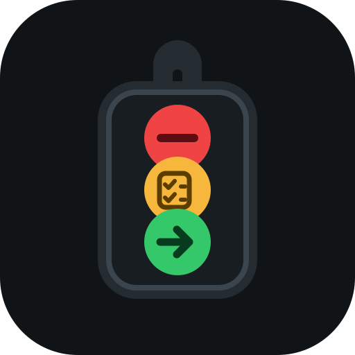

<p align="center">
  
</p>

# red-light-green-light

User-controlled authority for AI coding agents.

Every session starts Red. Only the user can grant Yellow or scoped Green authority.

- **Red:** read, research, and discuss. No file writes or mutating commands.
- **Yellow:** Red plus planning artifacts under approved planning paths.
- **Green:** implementation inside one user-named scope.

Completion, blockage, cancellation, or scope drift returns Green to Red.

> **v0.2 preview:** Pi is the verified reference adapter. Claude Code and Codex packaging, hook contracts, manifests, and failure behavior are tested locally; clean-machine installation is the final release check.

## Install

### Pi

```bash
pi install git:github.com/ERICJ3ffrey/red-light-green-light
```

Try without installing:

```bash
pi -e "C:/path/to/red-light-green-light"
```

Remove:

```bash
pi remove git:github.com/ERICJ3ffrey/red-light-green-light
```

### Claude Code

```bash
claude plugin marketplace add ERICJ3ffrey/red-light-green-light
claude plugin install red-light-green-light@red-light-green-light
```

Restart Claude Code, then inspect `/hooks` and confirm the plugin hooks are enabled. Claude commands are namespaced:

```text
/red-light-green-light:light status
/red-light-green-light:light yellow docs/plans
/red-light-green-light:light green implement docs/plans/auth.md --paths src/auth.js
```

### Codex

```bash
codex plugin marketplace add ERICJ3ffrey/red-light-green-light --ref master
codex plugin add red-light-green-light@red-light-green-light
```

Restart Codex, open `/hooks`, review the plugin hook definitions, and explicitly trust them. Untrusted plugin hooks are skipped by Codex.

Use exact natural-language transitions in Codex:

```text
red light
yellow light docs/plans
green light for implement docs/plans/auth.md
```

## Pi commands

```text
/light red
/light yellow [planning-path]
/light green <scope>
/light green <scope> --paths path-one,path-two
/light status
```

Pure exact natural-language transitions work across native adapters:

```text
red light
yellow light docs/plans
green light for implement docs/plans/auth.md
```

A pure transition changes authority only. Send the task separately or place it on the following line.

## Enforcement matrix

| Capability | Pi | Claude Code | Codex | Agent Skill only |
|---|---|---|---|---|
| Automatic startup Red | Native, verified | Native hook; preview | Native hook after trust; preview | No |
| User-only transitions | Native, verified | UserPromptSubmit hook | UserPromptSubmit hook | Instruction guarded |
| Red direct-write blocking | Mechanically guarded | PreToolUse for observed local tools | PreToolUse for observed local tools | Instruction guarded |
| Yellow planning paths | Mechanically guarded | Mechanically guarded for intercepted file tools | Mechanically guarded for intercepted `apply_patch` | Instruction guarded |
| Path-bound Green | Direct file tools | Intercepted file tools | Parsed `apply_patch` targets | Instruction guarded |
| Semantic Green scope | Instruction guarded | Instruction guarded | Instruction guarded | Instruction guarded |
| Protected command families | Blocked in every light | Blocked when intercepted | Blocked when intercepted | Instruction guarded |
| Hosted/specialized tool gaps | Unknown tools fail closed | Unknown intercepted tools fail closed | Some hosted/specialized paths do not emit hooks | Harness dependent |

A capability is called mechanically guarded only where the host exposes a pre-execution hook and the adapter classifies that tool call. Claude and Codex hooks execute with the user's permissions and can be disabled or left untrusted by the user or administrator.

## Protected actions

Green does not approve deployments, publishing, external sends, purchases, dependency installation, destructive operations, commits, pushes, or credential or configuration changes. Recognized protected command families remain blocked even in Green. Perform an approved protected action through a separate user-controlled channel.

## Threat model

`red-light-green-light` is a tool-call authorization layer, **not an OS sandbox**.

It restricts intercepted file and command tools at evaluation time. It does not protect against:

- concurrent external filesystem mutation;
- a compromised host, plugin, or extension;
- another process changing a path after authorization;
- semantic scope drift that cannot be reduced to paths;
- transitive behavior hidden inside an otherwise allowed executable;
- host tool paths that do not emit the documented pre-tool hook.

Traversal and symlink escapes present during path evaluation are denied. Unknown intercepted tools fail closed.

## Laptop smoke test

After installing on a clean machine:

1. Start a fresh session and ask for the current light. Expect Red.
2. Ask it to edit a source file. Expect refusal and no diff.
3. Set Yellow for `docs/plans` and request a plan plus a source edit. Expect only the plan.
4. Grant Green with a path allowlist and make the source change.
5. Complete the task. Expect `LIGHT_RELEASE: complete` and a return to Red.
6. Ask for another edit without Green. Expect refusal.
7. Ask it to commit or push. Expect refusal in every light.

Please capture the host version, install output, `/hooks` status, transcript, and final `git diff` when reporting a failure.

## Agent Skills compatibility

The canonical skill lives at `skills/red-light-green-light/SKILL.md`. Harnesses that install only the Agent Skill receive on-demand instructions, not native always-on enforcement.

## Development

Requires Node.js 22 or newer.

```bash
npm test
npm run validate
npm run acceptance:pi
claude plugin validate . --strict
npm pack --dry-run --json
```

The Pi acceptance command packs and extracts the artifact before testing it. Claude and Codex live acceptance evidence is required before the final v0.2.0 tag.

## License

MIT
